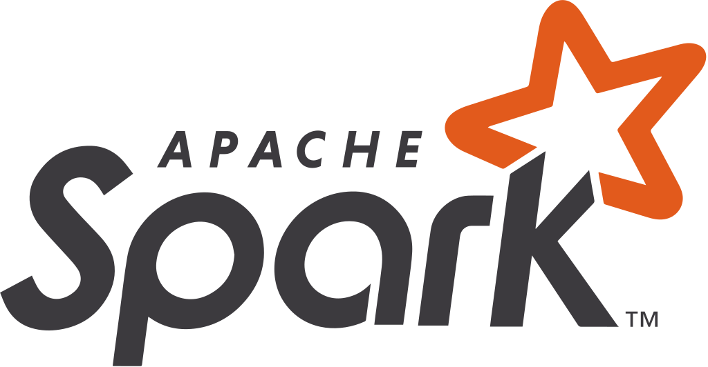

<h1 align="center">
    Hi , Welcome to my Github profile!
</h1>

 
    

- 🇻🇳 I am a dedicated Data Engineer from [Vietnam](https://www.google.com/maps/place/Vietnam).

- 🧑‍🎓 I graduated from [University of Information Technology](https://www.uit.edu.vn).

- 🔭 I am currently working on [Lakehouse Platform](https://github.com/nitsvutt/lakehouse-platform).

- 🌱 I am currently learning [Apache Flink](https://flink.apache.org/).

- 📝 All of my projects are available at [here](https://github.com/nitsvutt?tab=repositories).
    

<h2 align="center">Languages and Tools</h2>

    
    
    
    
    
    
    
    
    

    
    
    
    
    
    

    
    
    
    
    

<h2 align="center">Github Statistics</h2>

    
    

<h2 align="center">Contact me</h2>

    
    
    

